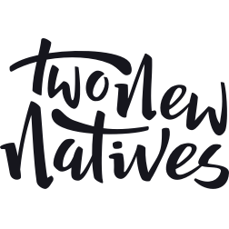
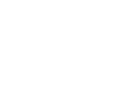

## Automated gallery creation

### Removing the need to create duplicate content across different platforms

Two New Natives hosts its images on community photography platforms like 500px and Flickr for social engagement. Their website synchronizes with these platfroms via API’s, so that when they create a new gallery on either one, it is automatically created on their site.

<c-video url="https://streamable.com/ck6zk"></c-video>

## Distraction free content

### Making the site easy to navigate, with easy to digest content

Paying special attention to providing clean, uncluttered layouts, organised and clear typography, and careful usage of colour pallete to frame the websites content were all top priorities.

## Handwritten logo

### Giving the brand a personal touch

Some content!

<c-grid columns="1-2" colorOne="#fc4f4f" colorTwo="#16161d">

</c-grid>
